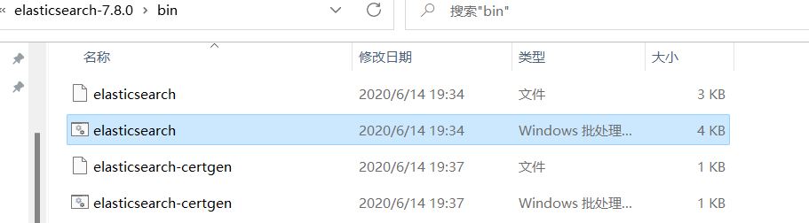
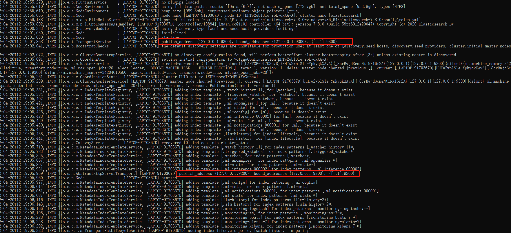
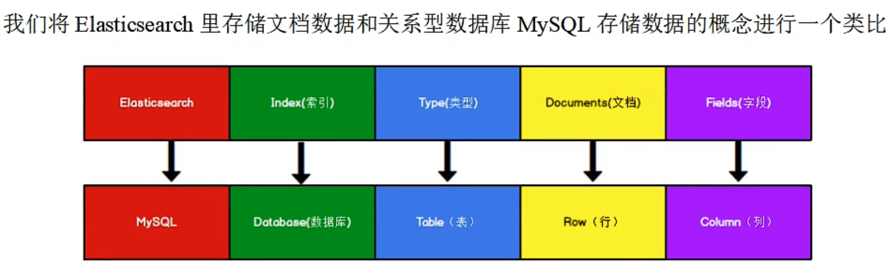

# Elasticsearch
###### 分布式、Restful风格的搜索和分析  

bin目录下的elasticsearch.bat文件启动  
     
 
     
9300端口为Elasticsearch集群间组件的通信端口，9200端口为浏览器访问的http协议的RESTful端口  
jdk需要1.8以上    
下载postman方便以后操作，可以发送任何http请求    
# 数据格式  
Es是面向文档型数据库，一条数据就是一个文档  
   

