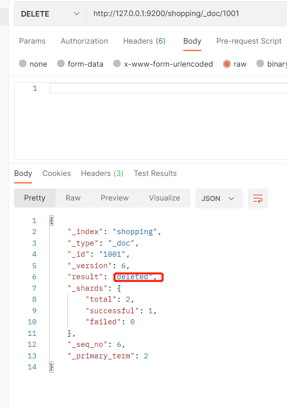

# Elasticsearch
###### 分布式、Restful风格的搜索和分析  

bin目录下的elasticsearch.bat文件启动  
     
 
     
9300端口为Elasticsearch集群间组件的通信端口，9200端口为浏览器访问的http协议的RESTful端口  
jdk需要1.8以上    
下载postman方便以后操作，可以发送任何http请求    
### 数据格式  
Es是面向文档型数据库，一条数据就是一个文档  
   
现代中Type的概念已经被弱化，在7.0以后的版本已经删除了该概念     
### 索引
###### 在ES中有一个很重要的概念是**倒排索引**   
先来说正排索引，就是根据key查value，但是在查询字段的时候用模糊查询效率很低    
而倒排索引是根据value的关键字查key   
倒排索引中强调的是关键字和文档编号的关联，表的概念已经不重要了  
###### 索引操作  
1. 创建索引     
``相当于Mysql创建数据库``     
PUT请求    
``http://127.0.0.1:9200/shopping``    
Put操作具有幂等性，两次操作都是一样的，第二次一样的操作会报错      
      
我们创建索引不能用post因为没有幂等性     

2. 获取索引相关信息    
GET请求   
    
获取所有的索引    
http://127.0.0.1:9200/_cat/indices?v       
3. 删除索引     
DELETE请求     
            

###### 文档操作  
``相当于Mysql中的表数据-行``        
**添加的数据格式为json串**            
1. 创建文档          
http:127.0.0.1:9200/shopping/_doc然后再加上请求体，写json数据串               
    
       
可以看到id属性是随机生成的，每次创建都不一样，但是这个id不好记，所以我们可以自定义id      
http:127.0.0.1:9200/shopping/_doc/1001   
   
其实_doc写成_create也是可以的     
  
**不指定id的话创建数据的主键是随机的，这种时候就不能用put，得用post，因为put是幂等性的**    
**而在_doc后面指定了id的话，put和post都可以，因为指定了id就具有幂等性了**   

2. 查看文档(发送get请求)    
``查看单一文档   
http://127.0.0.1:9200/索引/_doc/文档id   
``
     
``查看所有文档   
http://127.0.0.1/索引/_search ``   
     
**记得查询的时候，请求体不要写东西，不然会找不到页面400错误**     
   
3. 更新操作    
###### 1.全量修改，PUT请求,幂等性操作
和查看文档的命令一样，请求体body内添加要修改的数据，然后GET请求变成PUT请求   
    
"result":"updated"代表已经更新  
查询结果发现小米手机已经修改为苹果手机      
   
全量更新用的不多，更多的是局部属性的修改    
###### 2.局部修改，POST请求，非幂等性操作
  
记得请求体发送的是JSON数据  
  

###### 3.删除,DELETE请求
      
      
  

###### 4. 条件查询&分页查询& 查询排序   
   
http://127.0.0.1:9200/shopping/_search  然后在方法体里写查询内容    
    
    


###### 5. 多条件查询  
  
must是两个match都必须符合也就是 &  
如果要|查询,must改为should  
  

###### 6. 范围查询  
  

###### 7. match是全文检索  
比如小华这种情况就会将小米和华为手机都查出来，这就叫全文检索，因为ES在创建数据的时候会将字段拆分，然后去创建倒排索引，"小"也能查小米，"米"也能查小米      
``
{
"query" : {
        "match" : {
        "category" : "小华"
        }
    }
}    
``  
如果要完全匹配的话就将match改为match_phrase    

高亮显示：highlight       
    

###### 8. 聚合查询  
{
"aggs" : {  //聚合操作 
    "price_group" : { //名称，随意起名
        "terms" : { //分组
             ”field" : "price"  //分组字段
            }
        }
    }
}
上面的方式聚合查询也会显示原始数据，如果不想显示的话就在外面加"size" : 0
{
"aggs" : {  //聚合操作
    "price_group" : { //名称，随意起名
        "terms" : { //分组
             ”field" : "price"  //分组字段
            }
        }
    },
"size" : 0
}
求平均值,将上面的"terms"改为 "avg"
{
"aggs" : {  //聚合操作
    "price_group" : { //名称，随意起名
        "avg" : { //平均值
            ”field" : "price"  //分组字段
            }
        }
    },
"size" : 0
}

###### 9.  映射  
```json
{
    "properties" : {
        "name" : {
            "type" : "text",
            "index" : true 
        },
        "sex" : {
            "type" : "keyword",
            "index": true
        },
        "tel" : {
            "type" : "keyword",
            "index":false
        }
    }
}
```
type为text表示查询时可以分词，keyword表示查询时字段需要完全匹配才能查到                           
index表示是否可以索引查询    

证明我们的映射中，name的type为text(分词查询)生效      
     
 


